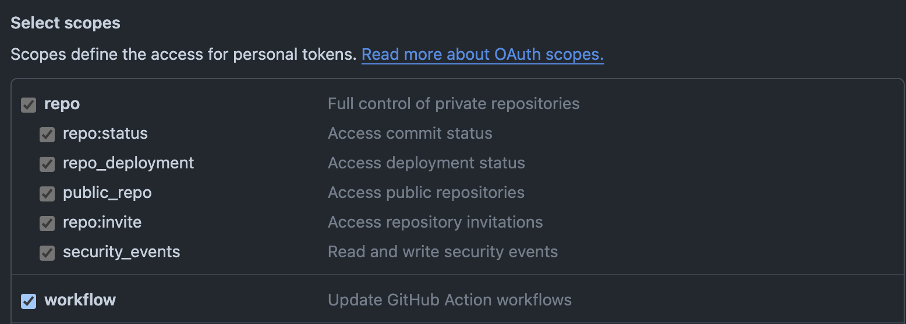
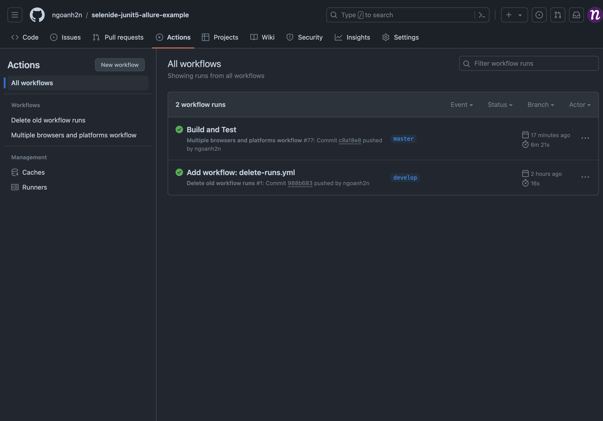
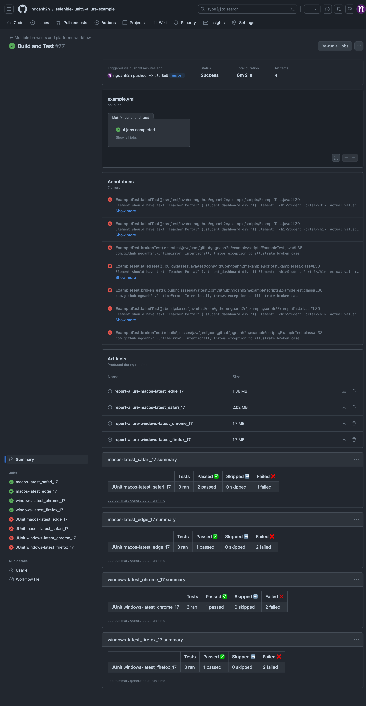
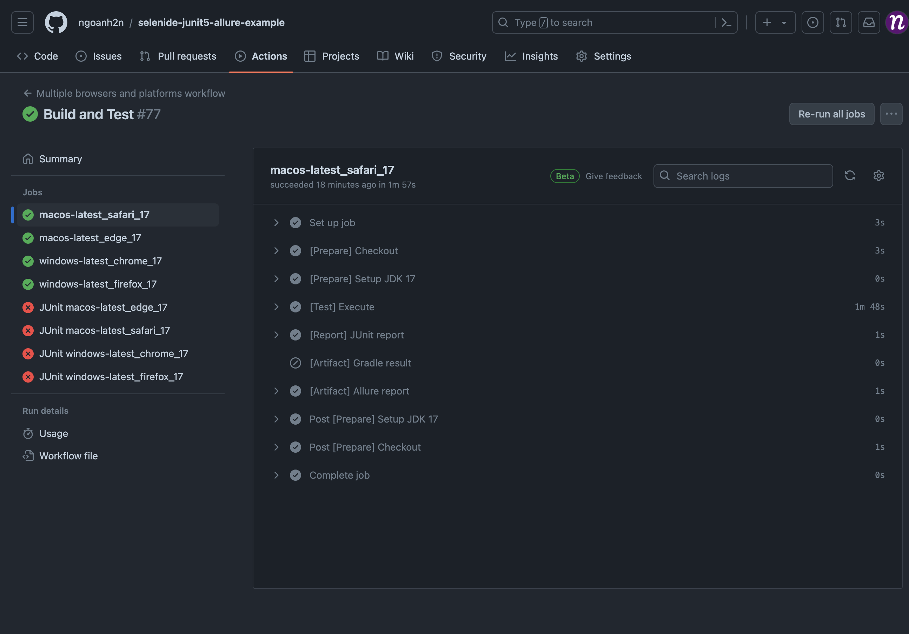
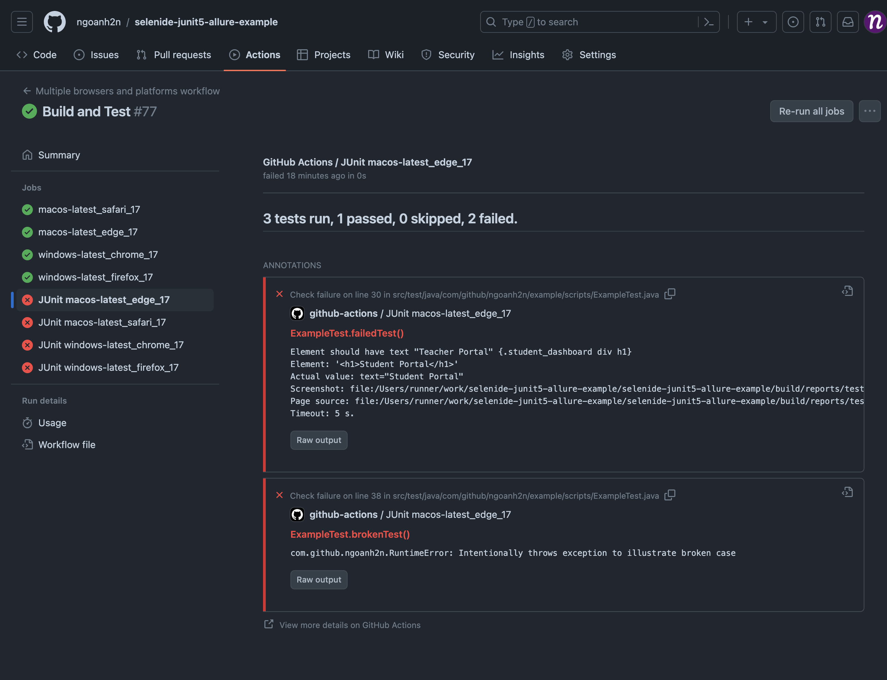




---

## Introduction
In this article, I will introduce how to build a CI/CD workflow (pipeline) with `GitHub Actions`. 
It enables you to automate build testing, and deployment pipelines.

{: .highlight .text-epsilon }
> I will set up the workflow for an automation testing project. 
> And this workflow will make the tests run on browsers corresponding to platforms:
> - `Safari` and `Edge` on `macOS` machine
> - `Chrome` and `Firefox` on `Windows` machine

Before we explore how to set up GitHub Actions, we need to understand how it works. All GitHub Actions automations are handled using workflows. Every workflow consists of several core concepts: `events`, `jobs`, `steps`, `actions`, and `runners`. 

{: .note-title .text-epsilon }
> Workflow
> 
> A workflow is an automated process made up of several jobs that are carried out when triggered by events. Workflows are defined in YAML files and stored in a `.github/workflows` directory in the repository.

{: .note-title .text-epsilon }
> Events
> 
> Events are defined triggers that start a workflow, such as creating a branch, opening a pull request, or commenting on an issue.

{: .note-title .text-epsilon }
> Jobs
> 
> Jobs are a set of steps that are executed in a workflow when an event is triggered. A workflow can have multiple jobs running in parallel.

{: .note-title .text-epsilon }
> Steps
> 
> Steps are individual tasks that run commands in a job. These can be an action or a shell command. All steps in a job execute on the same runner.

{: .note-title .text-epsilon }
> Actions
> 
> An action is a command that executed on a runner, and the core element of GitHub Actions, which is named after it.

{: .note-title .text-epsilon }
> Runners
> 
> A runner is a GitHub Actions server. It listens for available jobs, runs each in parallel, and reports back progress, logs and results. Each runner can be hosted by GitHub or self-hosted on a localized server. GitHub Hosted runners are based on Ubuntu Linux, Windows, and macOS.

## Prerequisite

### Repository {#prerequisite-repository}

{: .content .text-epsilon }
> 1. Create a repository at GitHub
> 2. Push your source codes of project to GitHub
> 
> _If you don't have an automation testing project yet, you can refer [selenide-junit5-allure-example](https://github.com/ngoanh2n/selenide-junit5-allure-example){:target="\_blank"} to try creating your own_.

### Access Token {#prerequisite-access-token}

{: .content .text-epsilon }
> 1. Go to GitHub [Personal Access Tokens](https://github.com/settings/tokens){:target="\_blank"} and generate a new token
> 2. Make sure you select both `repo` and `workflow` access scope<br>
> 

### Workflow File {#prerequisite-workflow-file}

{: .content .text-epsilon }
> Create `.github/workflows/example.yml` at root project
> ```
> ├── .github
> │   └── workflows
> │       └── example.yml
> ├── gradle
> ├── src/test
> ├── build.gradle
> ├── gradle.properties
> ├── gradlew
> ├── gradlew.bat
> └── settings.gradle
> ```

## Workflow

{: .highlight .text-epsilon }
[GitHub Docs: Actions](https://docs.github.com/en/actions){:target="\_blank"} <br>
[GitHub Marketplace: Actions to improve your workflow](https://github.com/marketplace?type=actions){:target="\_blank"}

### Names {#workflow-names}

{: .content .text-epsilon }
> ```yml
> # The name of your workflow. 
> # GitHub displays the names of your workflows on your repository's actions page. 
> # If you omit this field, GitHub sets the name to the workflow's filename.
> name: Multiple browsers and platforms workflow
> 
> # The name for workflow runs generated from the workflow. 
> # GitHub displays the workflow run name in the list of workflow runs on your repository's 'Actions' tab.
> run-name: Build and Test
> ```

### Events {#workflow-events}

{: .content .text-epsilon }
> ```yml
> on:
>   # Runs your workflow when someone pushes to a repository branch, 
>   # which triggers the push event.
>   push:
>     # Configure this workflow to run 
>     # when someone pushed to 'github-actions' branch.
>     branches:
>       - github-actions
> ```

### Jobs  {#workflow-jobs}

{: .content .text-epsilon }
> Now we declare a specified job, in our case we named `build_and_test`.
> ```yml
> # A workflow run is made up of one or more jobs. 
> # Jobs run in parallel by default.
> jobs:
>   # You can name it as you like.
>   build_and_test:
> ```

#### Settings {#workflow-jobs-settings}

{: .content .text-epsilon }
> ```yml
> jobs:
>   build_and_test:
>     # A map of default settings 
>     # that will apply to all steps in this job.
>     defaults:
>       run:
>         shell: bash
> ```

#### Strategy {#workflow-jobs-strategy}

{: .highlight .text-epsilon }
A strategy creates a build matrix for your jobs. You can define different variations of an environment to run each job in.

{: .content .text-epsilon }
> ```yml
> jobs:
>   build_and_test:
>     strategy:
>       # The maximum number of jobs that can run simultaneously 
>       # when using a matrix job strategy.
>       max-parallel: 2
>       # Set of different configurations of 
>       # the virtual environment for this build matrix.
>       matrix:
>         os: [macos-latest, windows-latest]
>         browser: [safari, edge, chrome, firefox]
>         java_version: [17]
>         # Remove specific configurations defined in the matrix.
>         exclude:
>           - os: macos-latest
>             browser: chrome
>           - os: macos-latest
>             browser: firefox
>           - os: windows-latest
>             browser: safari
>           - os: windows-latest
>             browser: edge
> ```

#### Runner {#workflow-jobs-runner}

{: .highlight .text-epsilon }
> The type of machine to run the job on. The machine can be either a GitHub-hosted runner, or a self-hosted runner. <br>
> _We expect GitHub-hosted runner which selected at `jobs.build_and_test.strategy.matrix.os`_.

{: .content .text-epsilon }
> ```yml
> jobs:
>   build_and_test:
>     runs-on: ${{ matrix.os }}
> ```

#### Name {#workflow-jobs-name}

{: .highlight .text-epsilon }
> Set name of this job displayed on GitHub. <br>
> _The name will be liked `macos-latest_safari_17` by pattern `{os}_{browser}_{java_version}`._

{: .content .text-epsilon }
> ```yml
> jobs:
>   build_and_test:
>     name: ${{ join(matrix.*, '_') }}
> ```

#### Env {#workflow-jobs-env}

{: .highlight .text-epsilon }
> A map of environment variables that are available to all steps in the job.

{: .content .text-epsilon }
> ```yml
> jobs:
>   build_and_test:
>     env:
>       MATRIX_JOB_NAME: ${{ join(matrix.*, '_') }}
> ```

#### Steps {#workflow-jobs-steps}

{: .highlight .text-epsilon }
> A job contains a sequence of tasks called steps. Steps can run commands, run setup tasks, or run an action.

{: .content .text-epsilon }
> 1. Checkout your repository
>     ```yml
>     jobs:
>       build_and_test:
>         steps:
>           - name: "[Prepare] Checkout"
>             uses: actions/checkout@v4
>     ```
> 2. Setup JDK
>     ```yml
>     jobs:
>       build_and_test:
>         steps:
>           - name: "[Prepare] Setup JDK 17"
>             uses: actions/setup-java@v4
>             with:
>               distribution: temurin
>               java-version: ${{ matrix.java_version }}
>     ```
> 3. Execute the test
>     ```yml
>     jobs:
>       build_and_test:
>         steps:
>           - name: "[Test] Execute"
>             id: test_execution
>             run: |
>               ./gradlew clean test --tests ExampleTest $VM_ARGS allureReport
>             env:
>               VM_ARGS: -Dselenide.browser=${{ matrix.browser }}
>     ```
> 4. Publish JUnit XML
>     ```yml
>     jobs:
>       build_and_test:
>         steps:
>           # Always run even if the previous step fails.
>           - if: success() || failure()
>             name: "[Report] JUnit report"
>             uses: mikepenz/action-junit-report@v4
>             with:
>               check_name: JUnit ${{ env.MATRIX_JOB_NAME }}
>               report_paths: build/reports/test/TEST-*.xml
>     ```
> 5. Upload Gradle test result
>     ```yml
>     jobs:
>       build_and_test:
>         steps:
>           # Run only when 'test_execution' step has failed.
>           - if: steps.test_execution.conclusion == 'failure'
>             name: "[Artifact] Gradle result"
>             uses: actions/upload-artifact@v4
>             with:
>               name: report-gradle-${{ env.MATRIX_JOB_NAME }}
>               path: build/reports/tests/test
>     ```
> 6. Upload Allure report
>     ```yml
>     jobs:
>       build_and_test:
>         steps:
>           # Always run even if the previous step fails.
>           - if: always()
>             name: "[Artifact] Allure report"
>             uses: actions/upload-artifact@v4
>             with:
>               name: report-allure-${{ env.MATRIX_JOB_NAME }}
>               path: build/allure/allureReport
>     ```

_Now you can modify somewhere in your project, and push it to repository_.

## Actions

### Workflows

{: .content .text-epsilon }
> 

### Jobs

{: .content .text-epsilon }
> 

### Job Details

{: .content .text-epsilon }
> 
> 
